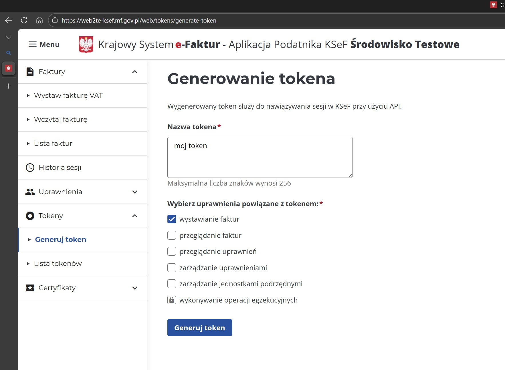

# Przykładowy mimalny test dla KSeF

Test pobrania i wysyłki faktur do Krajowy System e-Faktur 

## Jak to zrobić?

1. Wejdź na swoją firmę do systemu testowego podając swój NIP
https://ksef.podatki.gov.pl/bezplatne-narzedzia-ksef-20/aplikacja-podatnika-ksef-20-wersja-testowa/

2. Wygeneruj token

3. Zmień plik appsettings.json z Twoimi danymi
4. Uruchom
5. W logu konsoli zobaczysz komunikaty
6. W KSeF powinna pojawić się faktura