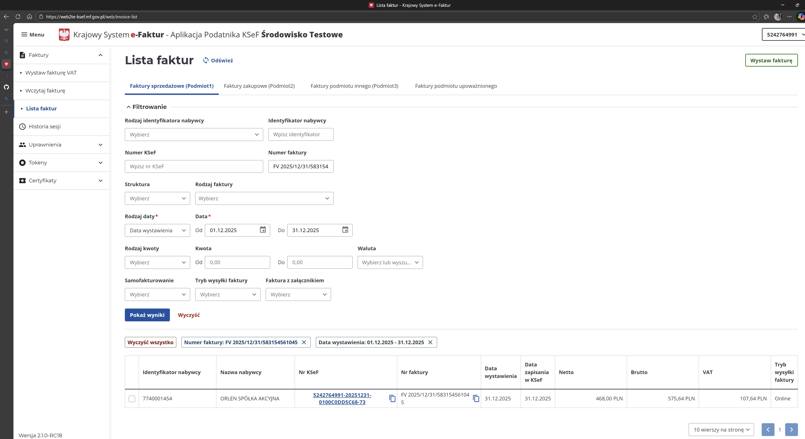

# Przykładowy mimalny test dla KSeF

Najprostszy test wysyłki e-faktury do Krajowy System e-Faktur za pomocą [KSeF Client](https://github.com/CIRFMF/ksef-client-csharp) 

## Jak to zrobić?

**Budowanie**

Przy budowaniu programu potrzebujesz ściągnąć nuget z KSeF Clientem który dostępny jest tylko na GitHub Packages.

Aby uzyskać dostęp do pakietów z GitHub Packages, musisz utworzyć osobisty token dostępu (PAT) z odpowiednimi uprawnieniami.

Ścieżka:

```bash
GitHub -> Settings -> Developer settings -> Personal access tokens -> Tokens (classic) -> Generate new token -> Generate new token (classic)
```

W sekcji Wybierz zakresy zaznacz read:packages, a następnie wygeneruj i skopiuj wartość tokena (będzie widoczna tylko raz).


```bash
dotnet nuget add source "https://nuget.pkg.github.com/CIRFMF/index.json" --name github-cirf --username token --password TUTAJ_PAT_TOKEN --store-password-in-clear-text
```

**Konfiguracja i uruchamianie**

1. Wejdź na swoją firmę do systemu [testowego KSeF](https://ksef.podatki.gov.pl/bezplatne-narzedzia-ksef-20/aplikacja-podatnika-ksef-20-wersja-testowa/) podając swój NIP

2. Wygeneruj token


3. Zmień plik appsettings.json z Twoimi danymi
4. Uruchom
5. W logu konsoli zobaczysz komunikaty
6. W KSeF powinna pojawić się faktura

